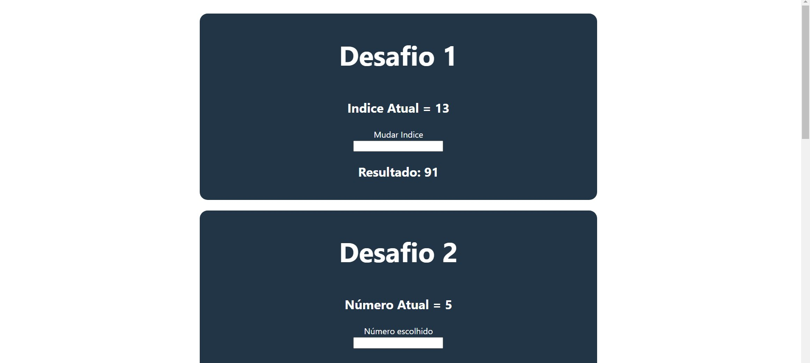

<h1 align="center"> Estágio Ribeirão Preto - 2024 </h1>

 

  

## 🚀 Tecnologias

Esse projeto foi desenvolvido com as seguintes tecnologias:

- HTML e CSS
- Javascript e React
- Git e Github

## 💻 Projeto

Estágio Ribeirão Preto - 2024, Projeto feito para etapa de desafio para vaga de estágio.

- [Acesse o projeto finalizado, online](https://st-gio-ribeir-o-preto-2024.vercel.app/)

